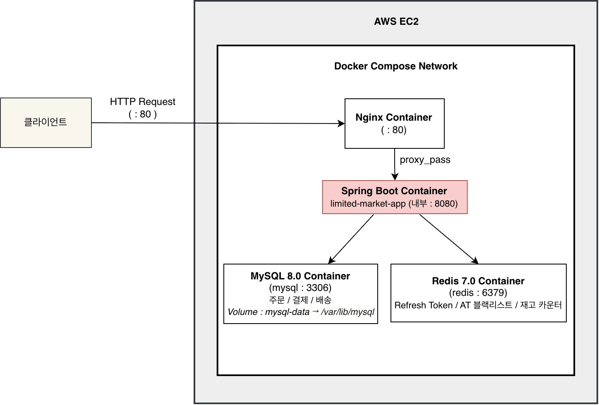
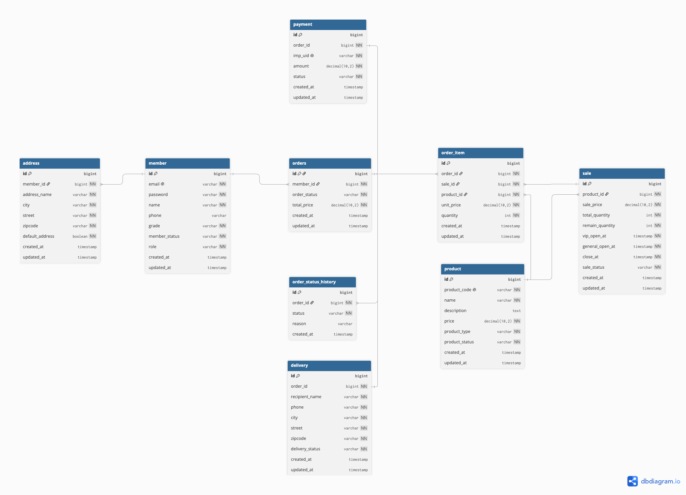

# Limited Market
Java 17 · Spring Boot · MySQL · Redis

한정 수량 상품의 동시 주문 환경에서 **데이터 정합성**과 **처리량**을 함께 고려한 선착순 주문 API입니다.

---

## 📌 프로젝트를 만든 이유

한정판 상품 판매 환경에서는 짧은 시간에 많은 사용자가 동시에 주문을 시도하면서 다음 문제가 발생할 수 있습니다.

* 초과 판매
* 재고 불일치
* 성능 저하

이 프로젝트는 동시성 문제를 해결하면서도 처리량을 유지하는 구조를 직접 설계하고 검증하는 것을 목표로 진행했습니다.

---

## ✨ 핵심 기능

| 기능    | 설명                           |
| ----- | ---------------------------- |
| 회원 인증 | JWT 기반 로그인                   |
| 상품 판매 | 회원 등급별 판매 시작 시간 적용           |
| 주문 관리 | 주문 · 결제 · 취소 처리         |
| 재고 관리 | Redis와 MySQL 기반 재고 관리        |
| 토큰 관리 | Redis 기반 Refresh Token 저장    |
| 배포    | Docker, Nginx, AWS EC2 기반 운영 |

---

## 🛠 Tech Stack

| 구분       | 기술                                    |
| -------- | ------------------------------------- |
| Backend  | Java 17, Spring Boot, Spring Data JPA |
| Database | MySQL, Redis                          |
| Infra    | Docker, Nginx, AWS EC2                |
| Test     | JUnit5, JMeter                        |

---

## 🏗 시스템 구조

### Architecture



### ERD



---

## 🔍 기술적 고민 및 해결

### 1. 선착순 주문 동시성 제어

Redis DECR로 품절 요청을 DB 진입 이전에 차단하고, 비관적 락으로 재고 차감의 정합성을 보장했습니다.

* Redis DECR로 불필요한 DB 접근 감소
* 비관적 락으로 재고 차감 정합성 확보
* 동시 10,000건 요청 환경에서 초과 판매 0건 유지

---

### 2. Redis와 DB 정합성 관리

MySQL을 기준 데이터로 두고 Redis를 재고 캐시로 사용했습니다.

* 주문 실패 시 Redis 재고 즉시 복구
* 주문 취소 시 DB 커밋 이후 Redis 재고 복구
* 애플리케이션 시작 시 MySQL 기준으로 Redis 재고 재적재

---

### 3. 다중 상품 주문 시 데드락 가능성 감소

다중 상품 주문 시 saleId 오름차순으로 락을 획득하도록 구성해 데드락 가능성을 줄였습니다.

---

### 4. 운영 환경 구성

```text
Client
   ↓
Nginx
   ↓
Spring Boot
   ↓
MySQL / Redis
```

Docker Compose와 Nginx를 이용해 운영 환경을 구성했습니다.

* Spring Boot, MySQL, Redis, Nginx를 Docker Compose로 구성
* 외부에는 80 포트만 노출
* 애플리케이션, DB, Redis는 내부 네트워크로 분리

---

## 🚀 실행 방법

```bash
git clone https://github.com/HaheeBahee/limited-market.git

docker compose up -d
```

---

## 📄 API 문서

### Local

http://localhost:8080/swagger-ui/index.html

### Deployment

http://13.124.129.7/swagger-ui/index.html

> 개인 AWS EC2 환경에서 운영 중입니다.
> 서버 상태 및 비용 상황에 따라 접속이 제한될 수 있습니다.

---

## 📂 프로젝트 구조
```text
src
 ├── main
 │   └── java/com/limitedmarket/api
 │       ├── domain
 │       │   ├── auth        # 인증, 토큰 재발급
 │       │   ├── member      # 회원, 등급
 │       │   ├── product     # 상품
 │       │   ├── sale        # 판매 오픈, 재고
 │       │   ├── order       # 주문, 취소
 │       │   ├── payment     # 결제
 │       │   ├── delivery    # 배송
 │       │   └── address     # 배송지
 │       │
 │       └── global
 │           ├── config      # Security, Swagger 설정
 │           ├── jwt         # JWT 발급, 검증, 필터
 │           ├── redis       # Redis 설정, 재고 초기화
 │           ├── security    # 인증 객체
 │           ├── exception   # 예외 처리
 │           └── response    # 공통 응답
 │
 └── test
     └── domain
         └── order           # 주문 생성, 취소 테스트
```
